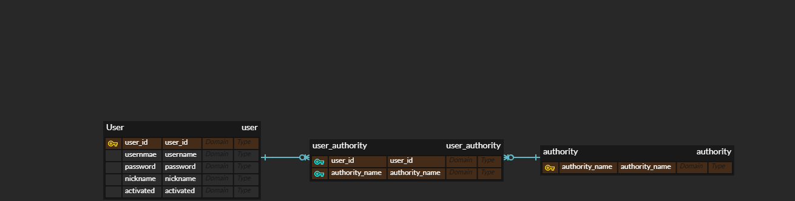

# JWT Tutorial

해당 프로젝트는 인프런 [Spring Boot JWT Tutorial] 강의를 수강하면서 실습한 프로젝트입니다.

[강의링크](https://github.com/SilverNine/spring-boot-jwt-tutorial)

### ERD


### Entity
- User
```java
@Entity
@Table(name = "user")
@Getter
@Setter
@Builder
@AllArgsConstructor
@NoArgsConstructor
public class User {

    @Id
    @Column(name="user_id")
    @GeneratedValue(strategy = GenerationType.IDENTITY)
    private Long userId;

    @Column(name="user_name", length = 50, unique = true)
    private String username;

    @Column(name="password", length = 100)
    private String password;

    @Column(name="nickname", length=50)
    private String nickname;

    @Column(name="activated")
    private boolean activated;

    @ManyToMany // 연관관계 매핑
    @JoinTable(
            name = "user_authority"
            joinColumns = {@JoinColumn(name="user_id", referencedColumnName = "user_id")},
            inverseJoinColumns = {@JoinColumn(name="authority_name", referencedColumnName = "authority_name")})
    private Set<Authority> authorities;

}
```

- Authority
```java
@Entity
@Table(name="authority")
@Getter
@Setter
@Builder
@AllArgsConstructor
@NoArgsConstructor
public class Authority {

    @Id
    @Column(name = "authority_name", length = 50)
    private String authorityName;
}

```